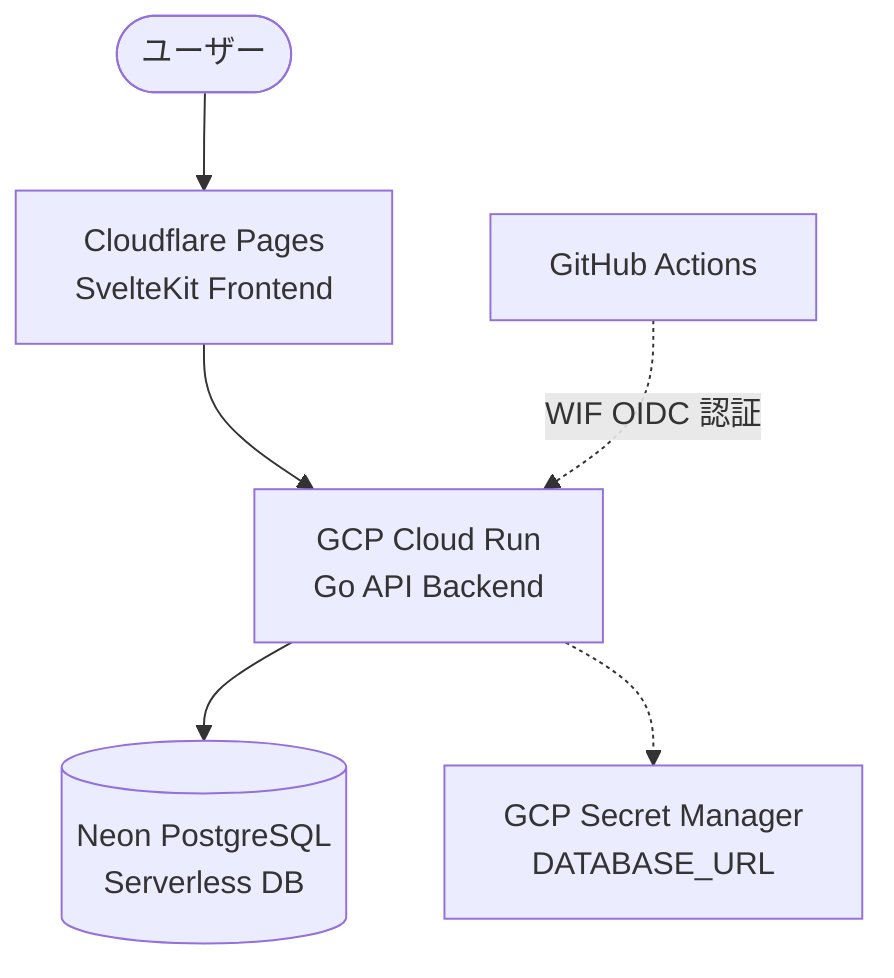

# Buildlog

SvelteKit と Go で構築された、極限までコストを最適化したセキュアなサーバーレス技術ブログ・ダイアリープラットフォーム。

---

## 🏗️ システムアーキテクチャ

本システムは、アクセスが無い時は完全にスリープ（課金0円）する構成で、インフラ費用を極限まで抑えた構成となっています。



### 技術スタック
* **フロントエンド**: SvelteKit (Tailwind CSS, TypeScript)
  * ホスティング: **Cloudflare Pages** (GitHub直接連携、デプロイトークン不要)
* **バックエンド**: Go (chi, GORM)
  * ホスティング: **GCP Cloud Run** (東京リージョン `asia-northeast1`, 1 vCPU, 256MiB, min-instances 0)
* **データベース**: **Neon PostgreSQL** (Freeプラン、5分間の未使用で自動スリープ・リクエスト時に自動コールドスタート)
* **シークレット管理**: **GCP Secret Manager** (APIキーや接続パスワードを安全に隠蔽)
* **CI/CD**: GitHub Actions + **GCP Workload Identity Federation (WIF)** (JSONキー不要のセキュアな認証)
* **マイグレーション**: **Atlas** (Declarative Database Migrations)

---

## 📁 ディレクトリ構成

* `web/` : SvelteKit フロントエンドアプリケーション
* `api/` : Go API バックエンドサーバー
* `sql/` : データベーススキーマ定義および Atlas マイグレーションファイル

---

## 🛠️ ローカル開発環境の立ち上げ

### 1. データベースの起動 (Docker)
ローカル用の PostgreSQL コンテナを起動します。
```bash
docker compose up -d
```

### 2. バックエンド API の起動
環境変数をロードし、APIサーバー（ポート 8081）を起動します。
```bash
cd api
make dev
```

### 3. フロントエンドの起動
SvelteKit 開発サーバー（ポート 5173）を起動します。
```bash
cd web
pnpm install
pnpm run dev
```
ブラウザで [http://localhost:5173](http://localhost:5173) にアクセスしてください。

### 4. ローカルマイグレーションの適用
データベーススキーマの変更があった場合は、以下のコマンドで適用します。
```bash
cd sql
atlas migrate apply --env local
```

---

## 🚀 デプロイと CI/CD

### バックエンドのデプロイ
GitHub の `main` ブランチにプッシュすると、GitHub Actions 経由で自動デプロイが走ります。
手動でコマンドからデプロイする場合は、`api` ディレクトリで以下を実行します。
```bash
cd api
make deploy-prod
```
*(※シークレット情報は GCP Secret Manager に登録されているため、コマンド引数でのパスワード指定は不要です)*

### フロントエンドのデプロイ
GitHub の `main` ブランチにプッシュすると、Cloudflare Pages が自動で検知して本番環境（https://buildlog-5jc.pages.dev）へ直接デプロイを行います。
